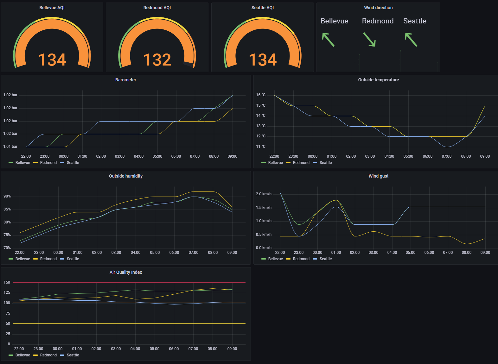

# iqair-influx

Allows for importing data from [IQAir](https://www.iqair.com/) to [InfluxDB](https://www.influxdata.com/) v2.

## Requirements

- An [IQAir API Key](https://www.iqair.com/dashboard/api).
- A device with either [Docker](https://www.docker.com/) or Python 3.7 or later installed.
- [InfluxDB](https://en.wikipedia.org/wiki/InfluxDB) v2 installed on this device or another device, and a bucket created in influxDB.

## Setup

### With Docker

Dependency: Docker installed.

1. Download and run the Docker image: `sudo docker run --name iqair -v config.yaml:/app/config.yaml vdbg/iqair-influx:latest`
2. Copy the template config file from the image: `sudo docker cp iqair:/app/template.config.yaml config.yaml`
3. Edit `config.yaml` by following the instructions in the file
4. Start the container again to verify the settings are correct: `sudo docker start iqair -i`
5. Once the settings are finalized, `Ctrl-C` to stop the container, `sudo docker container rm iqair` to delete it
6. Start the container with the final settings:

``
sudo docker run \
  -d \
  --name iqair \
  -v /path_to_your/config.yaml:/app/config.yaml \
  --memory=100m \
  --pull=always \
  --restart=always \
  vdbg/iqair-influx:latest
``

### Without Docker

Dependency: Python3 and pip3 installed. `sudo apt-get install python3-pip` if missing on raspbian.

1. Git clone this repository and cd into directory
2. `cp template.config.yaml config.yaml`
3. Edit file `config.yaml` by following the instructions in the file
4. `pip3 install -r requirements.txt`
5. `python3 main.py` or `./main.py`

## Troubleshooting

Although this isn't documented on IQAir's [plan comparison page](https://www.iqair.com/air-pollution-data-api/plans), it appears that with the free plan
the data is only refreshed once per hour. Since InfluxDB automatically de-dupes identical measurements, this means only two measurements (one weather, one pollution) per hour will end up showing up in the bucket.

The app makes one call per location, which can be affected by the throttling restrictions of the free plan:
* 5 requests per minute max: to query more than 5 locations, two options:
  1. create one docker container per group of 5 locations and start all containers at least one minute apart.
  2. specify more than one apiKey in `config.yaml`. The script will randomly choose one for each request.
* 10,000 requests per month max: for a month of 31 days, this means no more than 1 request every ~5 minutes for 1 location (10 minutes for 2 locations, 15m for 3, etc) if continuously running. Options:
  1. don't continuously query; for example, stop querying during the night
  2. specify more than one apiKey in `config.yaml`.

## Air Quality Index explained

The US and CN threseholds are both listed on [Wikipedia](https://en.wikipedia.org/wiki/Air_quality_index#United_States).

## Grafana

[This template](grafana/dashboard.json) is what produced the following [Grafana](https://grafana.com/) dashboard:

Note: the dashboard uses influxdb v1 compatibility mode. [This page](https://www.techetio.com/2021/11/29/influxdb-v2-using-the-v1-api-for-v1-dependent-applications/) explains how to enable it.
 